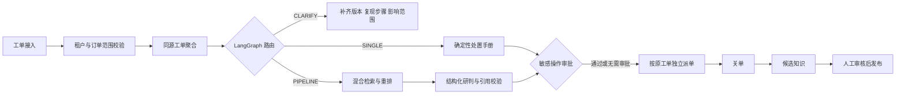

# CaseOps

CaseOps 是面向 SaaS 技术支持团队的多租户工单编排示例。它把工单接入、同源聚合、信息补齐、证据检索、人工审批、独立处置和知识回流组织为一条可测试的闭环，对应简历中的“智能客服工单处理与知识沉淀”项目。

仓库默认使用内存存储和可重复的离线研判器，因此无需模型或数据库也能运行测试。配置 `CASEOPS_MODEL_API_KEY` 后会切换到 DeepSeek 或其他 OpenAI 兼容模型；PostgreSQL、Redis 与 Milvus 的生产适配边界已经在配置、数据域过滤、数据库 schema 和 Compose 中保留，但当前示例没有假装已经完成全部基础设施接线。

## 核心流程



同源工单采用“研判合并、处置拆分”：多个用户遇到同一根因时共享诊断和证据，但每个工单仍保留自己的状态、审批与闭环。

## 与简历技术点的对应

| 简历能力 | 仓库实现 |
| --- | --- |
| SINGLE PIPELINE CLARIFY | `caseops.workflow.graph` 中的 LangGraph 条件路由 |
| 信息补齐 | `ExecutionRouter` 检查版本、复现步骤、影响范围 |
| 同源聚合 | `TicketAggregator` 组合语义、组件、版本与时间窗口 |
| BM25 BGE M3 重排 | `HybridRetriever` 提供可测试参考实现，并暴露语义相似度和 reranker 注入点 |
| DeepSeek | `OpenAICompatibleDiagnoser` 使用结构化 JSON、重试和引用白名单校验 |
| 多租户权限 | `DataScope` 贯穿工单、证据、审批和知识回流 |
| 敏感操作人工审批 | `ApprovalGate` 与审计事件阻止退款、删数、改权直接执行 |
| 知识回流 | 关单生成候选知识，审核通过后才能进入检索集合 |
| PostgreSQL Redis Milvus | PostgreSQL schema、Compose 服务和 Milvus filter 边界；本地测试使用内存适配器 |

更细的复用来源和改造理由见 [docs/REUSE_MAP.md](docs/REUSE_MAP.md)。

## 快速开始

```powershell
cd D:\Agent\04_代码\CaseOps
python -m venv .venv
.\.venv\Scripts\Activate.ps1
python -m pip install -e ".[dev]"
pytest
uvicorn caseops.api:app --host 0.0.0.0 --port 8080
```

没有模型密钥时，API 自动使用 `RuleBasedDiagnoser`。要接入 DeepSeek，可复制 `.env.example` 为 `.env` 并填写：

```dotenv
CASEOPS_MODEL_BASE_URL=https://api.deepseek.com/v1
CASEOPS_MODEL_NAME=deepseek-chat
CASEOPS_MODEL_API_KEY=your-key
```

## API 示例

所有业务请求都必须带数据域请求头。示例中的请求头模拟认证网关解析 JWT 后注入的可信上下文；生产环境不能直接信任公网客户端提供这些头。

```powershell
$headers = @{
  'X-Tenant-ID' = 'acme'
  'X-Actor-ID' = 'support-001'
  'X-Roles' = 'tenant_admin'
}

$ticket = Invoke-RestMethod -Method Post -Uri http://localhost:8080/v1/tickets `
  -Headers $headers -ContentType 'application/json' -Body (@{
    requester_id = 'user-1001'
    subject = '升级后无法登录'
    description = '2.1.0 升级后登录页循环跳转'
    component = 'auth'
    product_version = '2.1.0'
    reproduction_steps = '登录后返回登录页'
    impact_scope = '三个企业账号'
    tags = @('known_issue')
  } | ConvertTo-Json)

Invoke-RestMethod -Method Post -Uri http://localhost:8080/v1/cases/process `
  -Headers $headers -ContentType 'application/json' -Body (@{
    primary_ticket_id = $ticket.id
  } | ConvertTo-Json)
```

## 项目结构

```text
src/caseops/
  agents/         三模式路由策略
  application/    跨模块用例编排
  domain/         工单、案件、证据、知识候选等实体
  governance/     数据域与人工审批边界
  providers/      DeepSeek/OpenAI 兼容研判器
  repositories/   本地可测试存储适配器
  retrieval/      混合检索与重排接口
  tickets/        同源工单聚合
  workflow/       LangGraph 状态机
infra/postgres/   生产数据库 schema
tests/            租户隔离、路由、审批、知识回流测试
```

## 质量与安全边界

- 模型只能从已经通过 `DataScope` 的证据中引用文档 ID。
- 缺少关键信息时必须停在 `CLARIFY`，不会凭空补齐。
- 退款、删除数据、修改权限默认必须人工审批。
- 关单内容先进入候选区，未经审核不会进入检索集合。
- 本仓库不包含真实客户数据、生产密钥或简历中的业务指标数据集。

## 验证

```powershell
$env:PYTHONPATH = "$PWD\src"
pytest -q
python -m compileall -q src
```
